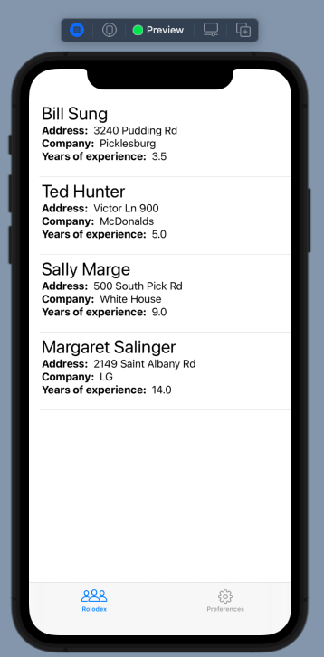
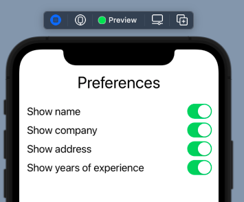

# Rolodex-Toggle-App-Foundations-Module4-Challenge6
This sample app demonstrates how to keep track/ share one environment variable across multiple screens.
It also displays two views via the TabView, and a preferences page.

